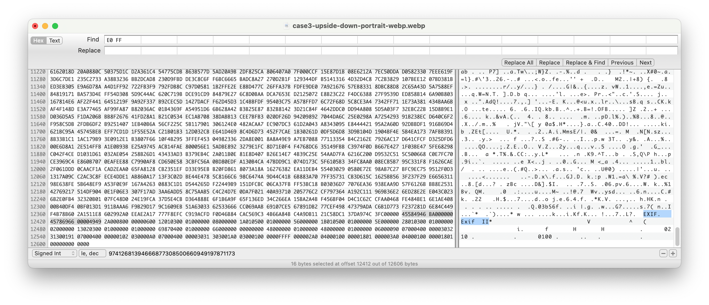

# Demo app to showcase the exif interface fix for webp 

Issue: 
======

When using https://developer.android.com/jetpack/androidx/releases/exifinterface the EXIF data isn't read in correctly causing rotation information not to be loaded. This bug was found after I noticed that coil wasn't respecting the orientation in webp files. Their jpg counter parts did rotate correctly.

Notes:
1. It's able to find the EXIF section but does not take into account the "Exif App1 Section"
2. This causes the the issue where it can't read the TIFF header correctly and fails to retrieve the byte-order information (which means it gives up on reading the exif metadata section)
3. The payload size should be the provided value minus the 6 bytes of the Exif App1 section. If this isn't corrected, you will read beyond the file size (or past the payload).

Example: 
========

Helpful notes that helped me debug: https://stackoverflow.com/a/8227753

Fix:
====

